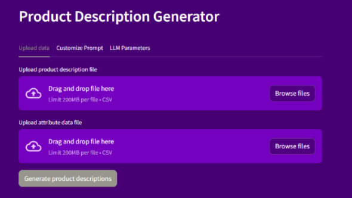

# GenAI Project - Product Description Generator

This repository contains an application that leverages OpenAI to generate product descriptions based on a set of input .csv files. 



**NOTES:**
* This application is based on [Streamlit](https://streamlit.io/) and is only intended for demo-purposes, running locally on a PC with a Python environment installed. 
* The notebook under `./notebooks` is a working document used as part of development and analysis by the development team, and should not be considered as deliverables. 
* Some example data is provided in csv format. This data should be replaced with new data, relevant for the specific use case.
* To change the app's color scheme, adjust the config file under `./.streamlit`. 

# Setup with Conda
## Install Anaconda
The following setup is based on Anaconda's Python distribution. Anaconda can be downloaded [here](https://www.anaconda.com/download).

## Setting up
With Anaconda installed, open a terminal and navigate to the project directory. Run the following commands:
```
conda create -n description-generator-poc python=3.10
conda activate description-generator-poc
conda install pip
pip install -r requirements.txt
```

## Creating an environments file
The application is dependent on an environments file which includes connection details for the Azure OpenAI service. 

In the project root directory, create a new file called `azureopenaiapikey.env`. Add the following text to the file:

```
OPENAI_API_KEY=API_KEY
OPENAI_API_TYPE="azure"
OPENAI_API_BASE="API_BASE"
OPENAI_API_VERSION="2023-07-01-preview"
```

Replace `API_KEY` with the API key and `API_BASE` with the url for your Azure OpenAI deployment. 

# Running the application
To run the application, run the following command from the root project directory:
```
streamlit run app.py
``````
If everything works fine you should be seeing a message saying that you can view your Streamlit app in your browser, along with a URL (e.g. `http://localhost:XXXX`, "XXXX" being a port number of 4 digits). 

Three tabs allows you to customize your prompt before generating the product description: 
* **Upload Data**: Upload two .csv files, one containing proudct information and one with related product attributes. See the `./test` folder for example input files. 
* **Customize prompt**: Allows you to change the system context and the guidelines used in the request to the LLM when generating the product descriptions. Enabling `Include examples in prompt ("few-shot-prompting")` will genereate three examples of input-output that the LLM model can use as reference. 
* **LLM Parameters**: Select which model to use (e.g. GPT-4 or GPT-3.5), and their parameters: `temperature`, `top_p`, `frequency penalty` and `presence penalty`.

When ready, click "Generate Product Descriptions" to make the application call the LLM service to generate product descriptions for the products given in the uploaded .csv files. 

Output can be viewed directly on the page or downloaded as a .csv.

# Initial evaluation of the results

To test the model performance, we used the same chat model with an instruction to evaluate and compare the results with the original descriptions. 

The `results_scoring.ipynb` notebook under `./notebooks` performs this evaluation.

The evaluator model evaluated and scoreed both the original description and the model outputs based on four metrics: 
* selling sentiment,
* grammar and structure, 
* information quality and 
* formatting. 

It also scores the model output based on formality and hallucinations. 

